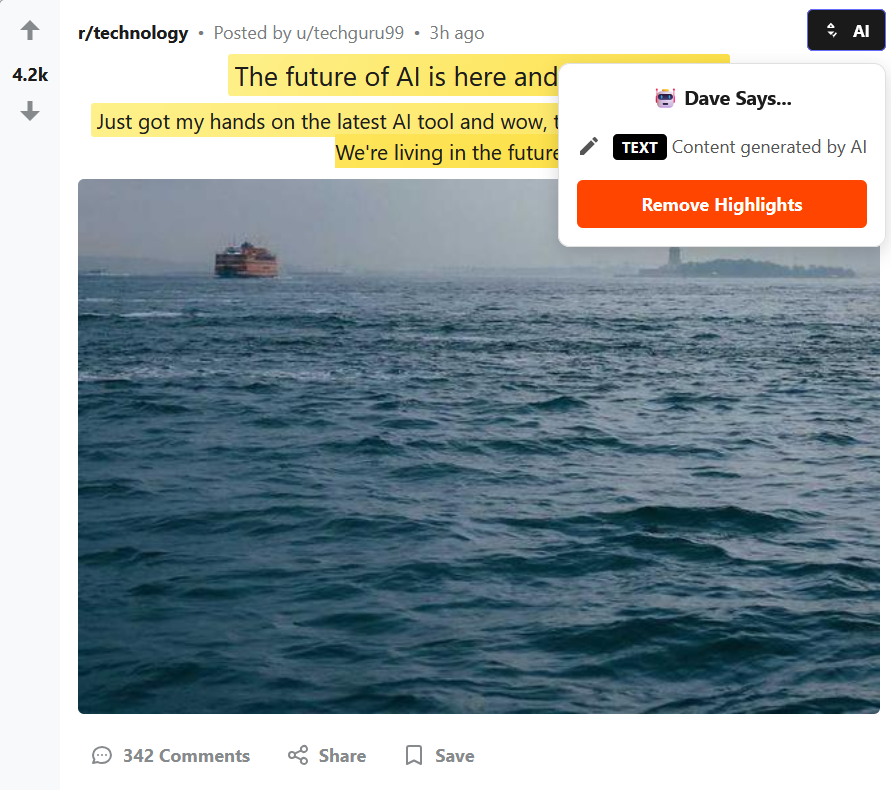

# 🤖 Detective David

### Background
As of late, social media is barely human. Captions written by LLMs, pictures generated by AI models and now, even videos! It sucks. It may only be an inconvenience for those who are informed, but for many, it is a major source of misinformation.

The internet is one of our current largest archives of information and a key source for all work on a daily basis. When the source that we depend on so heavily is now suddenly filled with mediocre and innaccurate content, we risk the danger of reducing our innate ability to generate such content. This is termed the '[AI Slop Singularity](https://www.theguardian.com/commentisfree/2025/apr/21/ai-slop-artificial-intelligence-social-media)', where the contents of the internet are so saturated by low-quality AI generated 'slop' that we tend to learn it's patterns and speak like it purely by repeated exposure.

The best way to prevent our brain from learning the patterns of the slop is to avoid it. How so?

It is almost impossible to stop sources from using AI to generate content, however, it is possible to distinguish between human generated and AI generated content using hashing algorithms like [SynthID](https://deepmind.google/models/synthid/). I used this as inspiration for my project, as I wanted to prototype a tool that runs on top of any internet page you visit to distinguish between real content and AI slop using SynthID technology. We can't reinvent the wheel and implement something that is baked into the framework of the internet, but we can make something that runs on top of it to help.

### Designing David
It was very important from the start that David should not interfere with the internet surfing experience. Based on research that I did for a previous project for using AI to enhance your browsing experience rather than offloading ([Project Gyrus](https://github.com/Aryagarg23/wb_hack_sf)), I found that almost all of the interviewees liked browsers that **stayed out of their way** when browsing. Considering this, it was an easy decision that David should be minimal in terms of space on screen.

Another consideration was to be specific about what part of the post contains AI-generated content. I have seen UI-based labels for AI-generated content on social media before but they are not specific. Instagram for example allows their creators, if they chose to be honest, to put a label on their post which lets users know that parts of the post are AI-generated. However, this does not specify which part of the post is AI-generated unless the user who made the post specified.

Finally, an extention of the above consideration, I wanted it to also highlight the specific portions of text that are AI-generated, similar to ZeroGPT's interface. This way, the user is not completely fear mongered away from a post and can keep theselves informed of what specific parts of the post to take with a grain of salt.

In summary, the three main considerations taken to design detective david are:
1. **Non-intrusive but still informational**
2. **Be specific when holding posts accountable**
3. **Highlight specific portions of post generated by AI-Models**
### How to use David?
David is designed to be less intrusive. In order to demonstrate how the plugin would work, I have created a replica of a famous social media platform that revolved around text and image-based posts.

Any post that is marked to be AI generated has a black flag on it, while posts that are certified to be human generated does not have a flag on it.

Clicking on the AI flag tells you what parts of the post are AI-generated.

For a post that has AI-generated text, it will also highlight the text that is generated by a model.

Clicking remove highlight will remove the yellow section of the post.
### Limitations and Future Improvements
Currently, the AI highlight just turns the entire text body or the image yellow, but in the future, it is intended to turn only the part of the text that is AI-generated.

Furthermore, more features are to be implemented